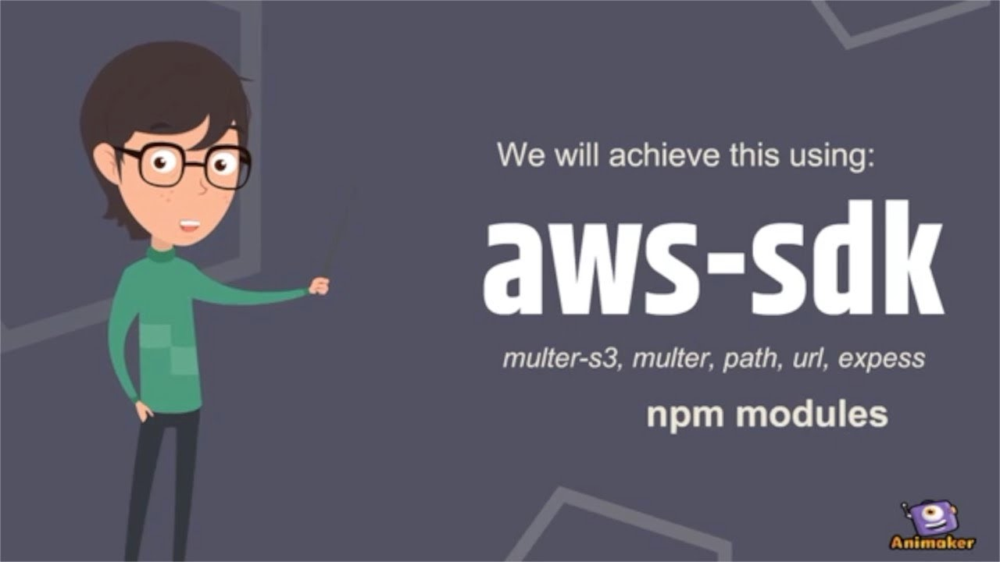
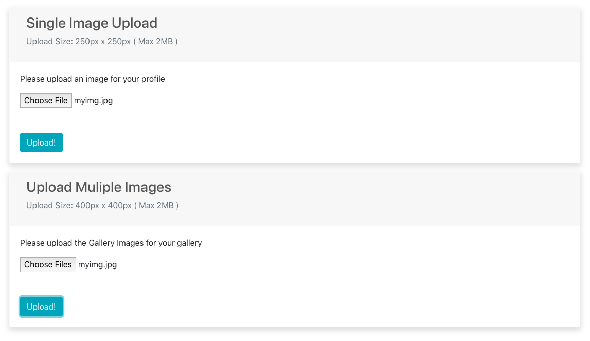

# File Uploads on AWS Bucket

## Description :clipboard:
> Demo App for Single and Multiple File Uploads on AWS ( Amazon Web Services ) Bucket

******* PLEASE STAR MY REPO TO SUPPORT ME 🙏 ******

Please follow me 🙏 on [twitter](https://twitter.com/imranhsayed) and github



## File Upload :computer:



## Use :point_right:

Update your AWS accessKeyId, secretAccessKey and Bucket name in `./routes/api/profile.js`

``` ruby
const s3 = new aws.S3({
	accessKeyId: 'xxx',
	secretAccessKey: 'xxx',
	Bucket: 'yourbucketname'
});

```

## Installation Instructions :wrench:

1. Clone the repo using `git clone https://github.com/imranhsayed/file-uploads-aws-react-node`
2. `cd file-uploads-aws-react-node`
3. `npm install`
4. `cd client`
5. `npm install`
7. `cd ..`
8. `npm run dev`

## Built With :zap:

1. Node
2. Express
3. React
4. Create React App

## Tutorial Videos :video_camera:

* [Create AWS Bucket](https://youtu.be/cDj4LPTLR3o)
* [Single File Upload on AWS](https://youtu.be/e-gb9IBfSw8)
* [Multiple File Upload on AWS](https://youtu.be/eLkVQI2xBD0)

## Useful Links :link:

* [Create AWS Bucket Blog](https://codeytek.com/how-to-create-a-user-and-bucket-amazon-web-services-aws/)
* [File Upload on AWS Blog](https://codeytek.com/file-or-image-uploads-on-amazon-web-services-aws-using-react-node-and-express-js-aws-sdk/)

## License

[](http://badges.mit-license.org)

- **[MIT license](http://opensource.org/licenses/mit-license.php)**
